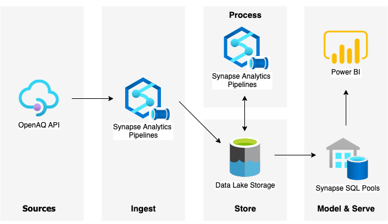
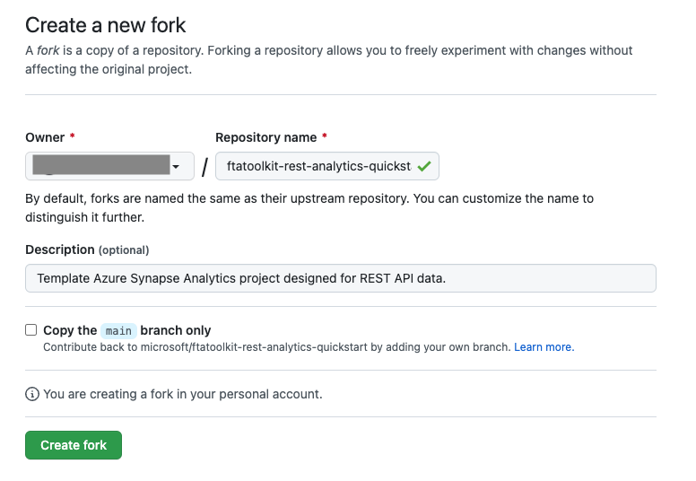
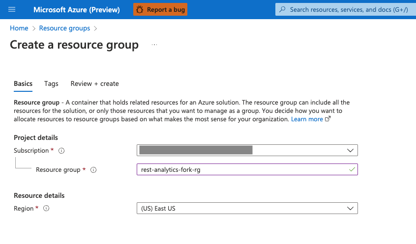
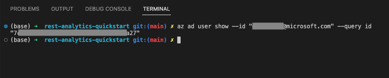
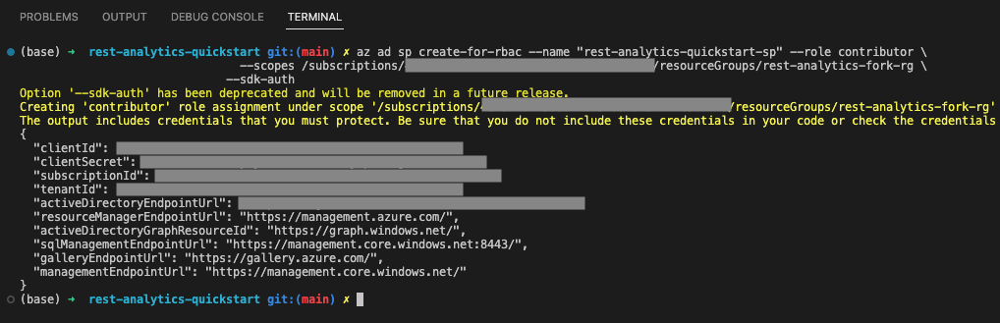
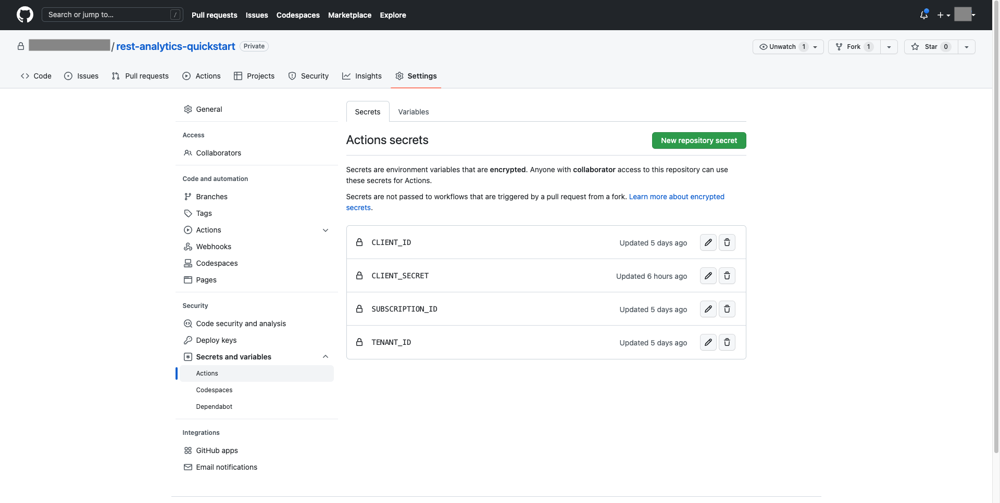
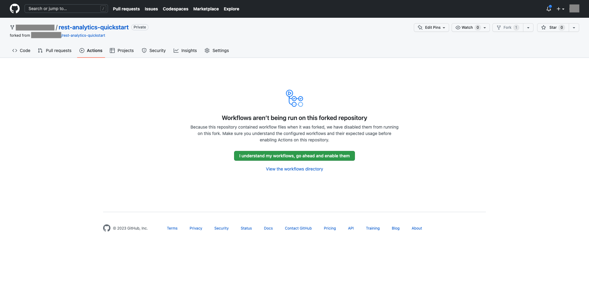
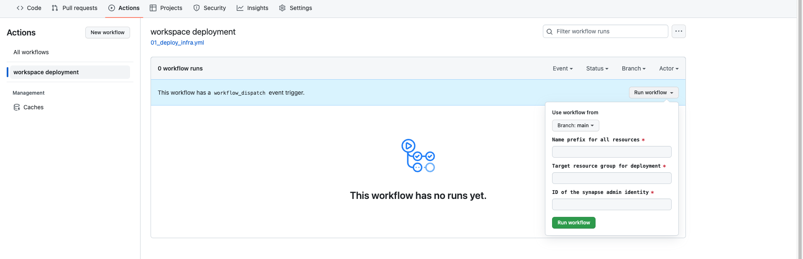
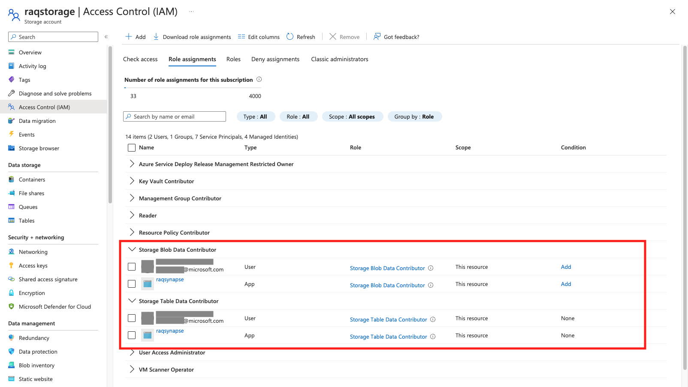
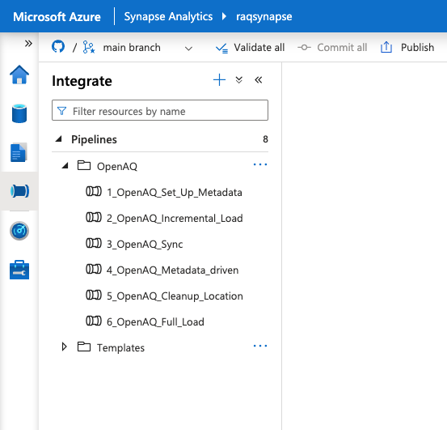

Move to Azure efficiently with customized guidance from Azure engineering. [FastTrack for Azure – Benefits and FAQ | Microsoft Azure](https://azure.microsoft.com/en-us/programs/azure-fasttrack/)

# REST Analytics Quickstart

In this repository, we've put together a template Azure Synapse Analytics project designed for data that is available through REST APIs.

## Table of contents
- [Overview](#overview)
- [Prerequisites](#prerequisites)
- [Solution Architecture](#solution-architecture)
- [Usage](#usage)
- [Result](#result)
- [Contributing](#contributing)
- [Trademarks](#trademarks)

## Overview

We have used the [OpenAQ API](https://docs.openaq.org/docs) as an example so you can quickly test the pipelines. The API exposes air quality data collected from multiple sensors. In this example, we will copy this data to our own Azure Data Lake and perform simple analytics and visualizations to prove out the concepts.

You may also adapt this repository to collect data from any REST API of your choice, even private endpoints behind firewalls and authentication.

## Prerequisites

To execute the steps below, you will need:

- An active Azure subscription
- Contributor access to a resource group

## Solution Architecture

## Usage

|Description|Screenshot|
|---|---|
|Fork this repository |  |
|Create resource group to deploy the quickstart resources |  |
|Determine your Azure AD user ID. You can run this command from the CLI:   `az ad user show --id "YOUR_EMAIL@COMPANY.COM" --query id` |  |
|Create a service principal with Contributor access to your resource group. You may use the Azure portal or the following CLI command to so so from the terminal:   `az ad sp create-for-rbac --name "PRINCIPAL_NAME" --role contributor --scopes /subscriptions/SUBSCRIPTION_ID/resourceGroups/RESOURCE_GROUP_NAME --sdk-auth`   You will need the command's output for the next step. |   |
|Go to Settings -> Secrets -> Actions and add the following secrets:   - CLIENT_ID   - CLIENT_SECRET   - SUBSCRIPTION_ID   - TENANT_ID   Use the information from the service principal created in the last step. |  |
|Go to Actions and enable workflows for the new repository |  |
|Run the `workspace deployment` workflow, which will deploy the Synapse workspace and all the template resources |  |
|Go the storage account and grant the following permissions:   - Storage Blob Data Contributor to yourself and to the Synapse Managed Identity   - Storage Table Data Contributor to yourself and to the Synapse Managed Identity |  |
|Check out and (optionally) run the pipelines under "OpenAQ". |  |

## Result

The following pipelines are available for you to test and integrate your own APIs:

- **1_OpenAQ_Set_Up_Metadata**: Checks if the metadata table exists and creates it if not.
- **2_OpenAQ_Incremental_Load**: Loads one chunk of data from the API for one sensor. 
    - Starts from the current watermark, or the MinDate parameter if no watermark is found.
    - Loads up until an amount of minutes determined by the DeltaMinutes parameter. Will fail if this puts the end of the window past the MaxDate parameter.
    - Saves data in parquet format, partitioning by manufacturer, device, year, month and day. Check out the Copy Data activity for more details.
    - Updates the watermark date to the end of the window loaded.
- **3_OpenAQ_Sync**: Sets up metadata and runs Incremental Load for one sensor until the MaxDate parameter is reached. 
    - This will load all new data, from the current watermark until MaxDate. 
    - Please monitor this pipeline closely, as this can be a large operation. The default parameters for MinDate and MaxDate will not consume significant resources.
- **4_OpenAQ_Metadata_Driven**: Lists sensors and runs 3_OpenAQ_Sync for each one. 
    - The default parameters will limit the listing operation to 5 sensors. In a real-world scenario, you'd have all active sensors being listed and sync'ed.
- **5_OpenAQ_Cleanup_Location**: Convenience pipeline to clear metadata and parquet files for a specific sensor. Useful for testing.
- **6_OpenAQ_Full Load**: Runs Cleanup and Sync operations in sequence for one sensor. Should rarely be used, only in case metadata gets out of sync or for testing purposes.

## Contributing

This project welcomes contributions and suggestions.  Most contributions require you to agree to a
Contributor License Agreement (CLA) declaring that you have the right to, and actually do, grant us
the rights to use your contribution. For details, visit https://cla.opensource.microsoft.com.

When you submit a pull request, a CLA bot will automatically determine whether you need to provide
a CLA and decorate the PR appropriately (e.g., status check, comment). Simply follow the instructions
provided by the bot. You will only need to do this once across all repos using our CLA.

This project has adopted the [Microsoft Open Source Code of Conduct](https://opensource.microsoft.com/codeofconduct/).
For more information see the [Code of Conduct FAQ](https://opensource.microsoft.com/codeofconduct/faq/) or
contact [opencode@microsoft.com](mailto:opencode@microsoft.com) with any additional questions or comments.

## Trademarks

This project may contain trademarks or logos for projects, products, or services. Authorized use of Microsoft 
trademarks or logos is subject to and must follow 
[Microsoft's Trademark & Brand Guidelines](https://www.microsoft.com/en-us/legal/intellectualproperty/trademarks/usage/general).
Use of Microsoft trademarks or logos in modified versions of this project must not cause confusion or imply Microsoft sponsorship.
Any use of third-party trademarks or logos are subject to those third-party's policies.